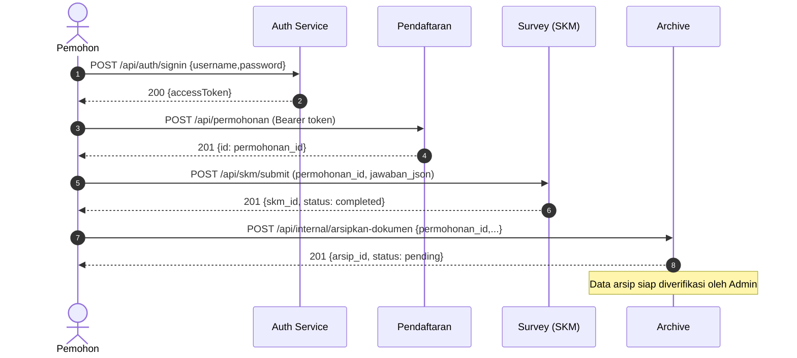
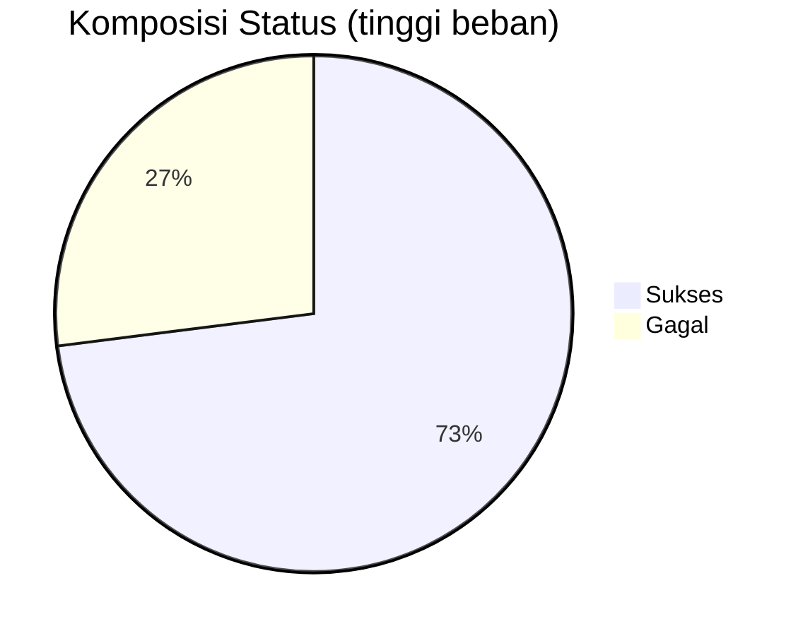

# Laporan Pengujian & Evaluasi Jelita Microservices

- Tanggal: 13 Nov 2025
- Lingkungan: Windows + Docker Desktop, PowerShell, Node.js 18, MySQL 8.0
- Stack layanan: Auth, Pendaftaran, Workflow, Survey (SKM), Archive

## Ringkasan Eksekutif
- Tujuan: Validasi fungsi, interoperabilitas antar layanan, dan uji skalabilitas dasar (baseline vs stress).
- Hasil singkat:
  - Fungsional: Semua alur utama berjalan (signin → permohonan → submit SKM → arsip → verifikasi).
  - Interoperabilitas: Token JWT dipakai lintas layanan; referensi `permohonan_id` konsisten dari Pendaftaran → Survey → Arsip.
  - Baseline (10 VUs, ~1m40s): p95 160 ms, ~52.7 req/s, error 6.68% (utama 404 pada baca arsip ketika data belum tersedia).
  - Stress (s.d. 300 VUs, ~7m): p95 9.64 s, error 26.85%, bottleneck pada login (p95 11.55 s) dan endpoint internal arsip (EOF di beban tinggi).

## Lingkungan Uji
- Docker Compose dengan 7 kontainer: `mysql`, `phpmyadmin`, `auth`, `pendaftaran`, `workflow`, `survey`, `archive`.
- Port: MySQL host 3307→container 3306; layanan: 3001/3010/3020/3030/3040; phpMyAdmin 8080.
- Database per layanan: `jelita_users`, `jelita_pendaftaran`, `jelita_workflow`, `jelita_survei`, `jelita_arsip`.
- Data ringkas (akhir sesi): Users=4, Permohonan=1, SKM=1, Arsip=4810.

## Validasi Fungsional
- Auth: `POST /api/auth/signin` mengembalikan `accessToken` (JWT) dengan payload `{id, role}`.
- Pendaftaran: `POST /api/permohonan` membuat permohonan ID 1 (menyimpan `data_pemohon`).
- Survey: `POST /api/skm/submit` menerima `permohonan_id=1` dan `jawaban_json`, status `completed` tersimpan.
- Archive: `POST /api/internal/arsipkan-dokumen` membuat arsip (tanpa auth, internal), `GET /api/arsip/:id` perlu role Admin/OPD/Pimpinan.

### Tabel Status Endpoint (sampel uji manual)
| Layanan | Endpoint | Metode | Auth | Hasil |
|---|---|---|---|---|
| Auth | `/api/auth/signin` | POST | - | 200, `accessToken` ✓ |
| Pendaftaran | `/api/permohonan` | POST | Bearer | 201, ID=1 ✓ |
| Survey | `/api/skm/submit` | POST | Bearer (Pemohon) | 201, SKM ID=1 ✓ |
| Archive | `/api/internal/arsipkan-dokumen` | POST | - | 201, Arsip ID bertambah ✓ |
| Archive | `/api/arsip/1` | GET | Bearer (Admin) | 200, data arsip ✓ |

## Interoperabilitas (Alur Lintas Layanan)


## Uji Beban — Baseline (k6)
- Skenario: 10 VUs, ~1m40s, health check + signin + baca arsip sederhana.
- Hasil utama:
  - Throughput: ~52.7 req/s
  - p95 `http_req_duration`: ~160 ms
  - Error rate: ~6.68% (utama dari 404 `GET /api/arsip/1` saat data belum ada di sebagian iterasi)

| Metrik | Nilai |
|---|---|
| VUs | 10 |
| Durasi | 1m40s |
| Request/s | ~52.7 |
| p95 Latensi | ~160 ms |
| Error Rate | ~6.68% |

Catatan: Setelah perbaikan endpoint (`/signin`, `accessToken`), error fungsional menurun; sisanya 404 yang expected pada data terbatas.

## Uji Beban — Stress (k6)
- Skenario: naik bertahap s.d. 300 VUs (~7m); memicu arsip internal, login, dan baca arsip.
- Hasil utama (diringkas dari log k6):
  - Total Requests: ~22,170 (±52.65 req/s)
  - p95 `http_req_duration`: ~9.64 s
  - Error Rate: ~26.85%
  - p95 `login_duration`: ~11.55 s (indikasi bottleneck login atau DB/IO)
  - p95 `archive_duration`: ~403 ms (bagian arsip relatif cepat; error `EOF` muncul saat beban tinggi)

| Metrik | Nilai |
|---|---|
| VUs max | 300 |
| Durasi | ~7m |
| Total Requests | ~22,170 |
| Request/s | ~52.65 |
| p95 Latensi | ~9.64 s |
| Error Rate | ~26.85% |
| p95 Login | ~11.55 s |
| p95 Archive | ~403 ms |

Visual ringkas proporsi error (estimatif):


## Observasi Kinerja & Bottleneck
- Login menjadi bottleneck di beban tinggi (p95 > 10 s). Potensi penyebab:
  - Hashing bcrypt tanpa pengaturan concurrency limit.
  - Koneksi DB terbatas/pooling default belum dioptimasi.
  - Tidak ada cache untuk profil/user claims.
- Endpoint internal arsip sesekali gagal dengan `EOF` saat beban tinggi → indikasi kehabisan koneksi, timeout upstream, atau backpressure belum diatur.
- Snapshot resource (saat uji): MySQL ~417 MB RAM, CPU ~2–5%; layanan Node RAM 35–80 MB; menunjukkan bottleneck bukan CPU-bound tetapi I/O/latensi eksternal.

## Evaluasi Interoperabilitas
- Autentikasi lintas layanan via JWT: valid dan terverifikasi pada Pendaftaran/Survey/Archive.
- Referensi entitas lintas DB: `permohonan_id` dari Pendaftaran digunakan di Survey dan Archive tanpa inkonsistensi.
- Hak akses: `GET /api/arsip/:id` dibatasi role; percobaan akses Pemohon ditolak sesuai desain (perlu Admin/OPD/Pimpinan).

## Rekomendasi Peningkatan
- Skalabilitas layanan:
  - Tambah gateway/load balancer (Nginx/Traefik) agar scaling `auth` dan layanan lain dapat memanfaatkan multiple replicas (host port single saat ini membatasi scaling efektif).
  - Aktifkan connection pooling eksplisit (Sequelize: `pool.max`, `acquire`, `idle`) dan naikan `max_connections` MySQL bila aman.
  - Rate limit dan queue internal untuk endpoint `internal/arsipkan-dokumen` guna hindari `EOF`/timeout di burst tinggi.
  - Kurangi biaya login: atur `bcrypt` cost factor yang seimbang atau gunakan worker threads; tambahkan cache session/claims (Redis) untuk read-heavy.
  - Observability: tambahkan tracing (OpenTelemetry), metrics (Prometheus), dan log korrelasi antar layanan.
- Interoperabilitas:
  - Tambahkan contract tests (Pact) untuk antar layanan.
  - Endpoint internal sebaiknya dibelakangi message broker (RabbitMQ/Kafka) agar lebih tahan beban dan reliabel.

## Cara Reproduksi Cepat (PowerShell)
```powershell
# 1) Jalankan stack
docker-compose up -d --build

# 2) Inisialisasi DB semua layanan
./docker/setup-databases.ps1

# 3) Login (Pemohon)
Invoke-RestMethod -Uri "http://localhost:3001/api/auth/signin" -Method POST -ContentType "application/json" -Body '{"username":"pemohon_demo","password":"demo123"}'

# 4) Buat permohonan
$token = '<ACCESS_TOKEN_PEMOHON>'
$perm = @{user_id=1; data_pemohon=@{jenis_izin="SIPPT"; nama="Pemohon Demo"}} | ConvertTo-Json -Depth 3
Invoke-RestMethod -Uri "http://localhost:3010/api/permohonan" -Method POST -Headers @{Authorization="Bearer $token"} -ContentType "application/json" -Body $perm

# 5) Submit SKM
$skm = @{permohonan_id=1; user_id=1; jawaban_json=@{nilai_1=4;niali_2=5}} | ConvertTo-Json -Depth 3
Invoke-RestMethod -Uri "http://localhost:3030/api/skm/submit" -Method POST -Headers @{Authorization="Bearer $token"} -ContentType "application/json" -Body $skm

# 6) Arsipkan (internal)
Invoke-RestMethod -Uri "http://localhost:3040/api/internal/arsipkan-dokumen" -Method POST -ContentType "application/json" -Body '{"permohonan_id":1,"nomor_izin":"SIPPT/001/2025"}'

# 7) k6 baseline
cd tests; k6 run loadtest-baseline.js

# 8) k6 stress (menyimpan raw events JSON)
k6 run loadtest-stress.js --out json=stress-results.json
```

## Lampiran
- Artefak: `tests/stress-results.json` (hasil raw events k6 stress test).
- Skrip uji: `tests/loadtest-baseline.js`, `tests/loadtest-stress.js`, `tests/test-e2e-integration.js`.
- Health endpoints: semua layanan memiliki `GET /health` untuk readiness checks.

---
Kesimpulan: Implementasi microservices telah berfungsi secara end-to-end dengan interoperabilitas yang baik. Pada baseline, performa responsif; pada stress, bottleneck utama pada login dan internal archive saat beban tinggi. Optimasi dan arsitektur scaling (gateway, pooling, broker) direkomendasikan sebelum uji skala lebih lanjut.
