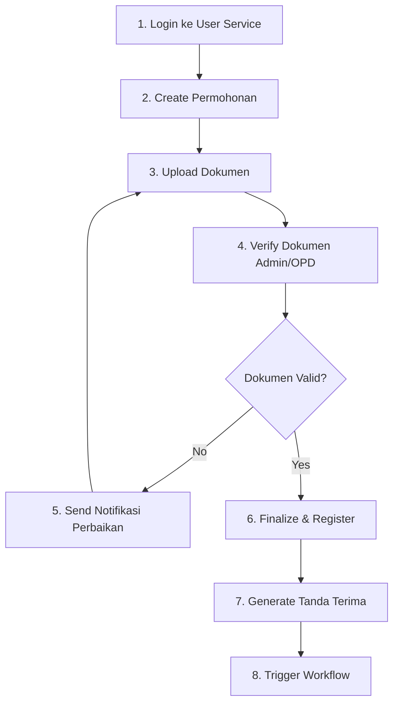

# Panduan Pengujian Application Service dengan Postman

## Daftar Isi
1. [Persiapan](#persiapan)
2. [Import Collection & Environment](#import-collection--environment)
3. [Workflow Testing](#workflow-testing)
4. [Testing Setiap Endpoint](#testing-setiap-endpoint)
5. [Troubleshooting](#troubleshooting)

---

## Persiapan

### 1. Install Dependencies
```powershell
cd d:\KULIAH\TESIS\prototype\layanan-pendaftaran
npm install
```

### 2. Konfigurasi Database
Pastikan database MySQL sudah berjalan dan sesuaikan file `.env`:

```properties
PORT=3010
DB_HOST=localhost
DB_USER=root
DB_PASSWORD=Enter*123
DB_NAME=jelita_permohonan
JWT_SECRET=FFbdqS6NVE7ARw08MNUAj0+sqXo7ZCEbZF7igEbMUH6tni78oAjzSPqYXvoyP02N
WORKFLOW_SERVICE_URL=http://localhost:3020
UPLOAD_PATH=./uploads
MAX_FILE_SIZE=5242880
```

### 3. Buat Database dan Tables
```sql
CREATE DATABASE IF NOT EXISTS jelita_permohonan;
USE jelita_permohonan;

-- Table permohonan
CREATE TABLE IF NOT EXISTS permohonan (
  id INT AUTO_INCREMENT PRIMARY KEY,
  user_id INT NOT NULL,
  nomor_registrasi VARCHAR(100) UNIQUE,
  status VARCHAR(50) NOT NULL,
  data_pemohon JSON NOT NULL,
  created_at DATETIME DEFAULT CURRENT_TIMESTAMP,
  updated_at DATETIME DEFAULT CURRENT_TIMESTAMP ON UPDATE CURRENT_TIMESTAMP
);

-- Table dokumen
CREATE TABLE IF NOT EXISTS dokumen (
  id INT AUTO_INCREMENT PRIMARY KEY,
  permohonan_id INT NOT NULL,
  jenis_dokumen VARCHAR(100) NOT NULL,
  nama_file VARCHAR(255) NOT NULL,
  path_file VARCHAR(500) NOT NULL,
  ukuran_file INT NOT NULL,
  status_verifikasi ENUM('pending', 'verified', 'rejected') DEFAULT 'pending',
  catatan_verifikasi TEXT,
  verified_by INT,
  verified_at DATETIME,
  created_at DATETIME DEFAULT CURRENT_TIMESTAMP,
  updated_at DATETIME DEFAULT CURRENT_TIMESTAMP ON UPDATE CURRENT_TIMESTAMP,
  FOREIGN KEY (permohonan_id) REFERENCES permohonan(id) ON DELETE CASCADE
);
```

### 4. Jalankan Server
```powershell
cd d:\KULIAH\TESIS\prototype\layanan-pendaftaran
node server.js
```

Pastikan muncul: `Application Service is running on port 3010`

---

## Import Collection & Environment

### Import Files
1. Buka Postman
2. Klik **Import**
3. Pilih kedua file:
   - `postman/Application_Service.postman_collection.json`
   - `postman/Application_Service.postman_environment.json`
4. Klik **Import**

### Aktifkan Environment
1. Klik dropdown Environment (kanan atas)
2. Pilih **Application Service - Development**

---

## Workflow Testing

### Skenario Lengkap (Happy Path)



### Step-by-Step Testing Flow

**IMPORTANT:** Jalankan endpoint dalam urutan ini:

1. **Prerequisite**: Login di User Service (port 3005/3001)
   - Endpoint: `POST /api/auth/signin`
   - Dapatkan token dan simpan ke environment variable

2. Create New Permohonan (Pemohon)
3. Upload Document (Pemohon)
4. Verify Document (Admin/OPD)
5. (Optional) Send Correction Notification jika ada masalah
6. Finalize & Register (Admin/OPD)
7. Generate PDF Receipt
8. Trigger Workflow Service
9. Check Application Status (anytime)

---

## Testing Setiap Endpoint

### Prerequisite: Mendapatkan Token

**PENTING**: Sebelum testing, Anda harus mendapatkan token dari **User & Auth Service**.

#### Cara 1: Menggunakan Postman Collection User Service
```powershell
# Jalankan User Service di port berbeda
cd d:\KULIAH\TESIS\prototype\layanan-manajemen-pengguna
$env:PORT=3001; node server.js
```

Lalu di Postman:
- Import collection User Auth Service
- Jalankan **Sign In** dengan credentials: `demo / demo123`
- Token akan otomatis tersimpan di `AUTH_HEADER`

#### Cara 2: Manual dengan PowerShell
```powershell
$body = @{ username='demo'; password='demo123' } | ConvertTo-Json
$response = Invoke-RestMethod -Method Post -Uri http://localhost:3001/api/auth/signin -Body $body -ContentType 'application/json'
$token = "Bearer " + $response.accessToken
Write-Host $token
```

Copy token dan paste ke environment variable `AUTH_HEADER`.

---

### 1. POST /api/permohonan - Create New Permohonan

**Role:** Pemohon (authenticated user)

**Request:**
```json
{
    "data_pemohon": {
        "nama": "John Doe",
        "alamat": "Jl. Merdeka No. 123",
        "telepon": "081234567890",
        "email": "john@example.com",
        "jenis_izin": "Izin Mendirikan Bangunan",
        "lokasi_izin": "Jl. Sudirman No. 45"
    }
}
```

**Headers:**
- `Authorization`: `{{AUTH_HEADER}}`
- `Content-Type`: `application/json`

**Expected Response (201 Created):**
```json
{
    "message": "Permohonan created successfully",
    "data": {
        "id": 1,
        "user_id": 1,
        "nomor_registrasi": null,
        "status": "draft",
        "data_pemohon": {
            "nama": "John Doe",
            "alamat": "Jl. Merdeka No. 123",
            ...
        },
        "created_at": "2025-11-11T10:00:00.000Z",
        "updated_at": "2025-11-11T10:00:00.000Z"
    }
}
```

**Auto-save:** `PERMOHONAN_ID` tersimpan otomatis ke environment

---

### 2. PUT /api/permohonan/:id - Update Permohonan

**Role:** Pemohon (owner) atau Admin/OPD

**URL:** `{{BASE_URL}}/api/permohonan/{{PERMOHONAN_ID}}`

**Request:**
```json
{
    "data_pemohon": {
        "nama": "John Doe Updated",
        "alamat": "Jl. Merdeka No. 123 (Revised)",
        "telepon": "081234567890",
        "email": "john.updated@example.com",
        "jenis_izin": "Izin Mendirikan Bangunan",
        "lokasi_izin": "Jl. Sudirman No. 45"
    }
}
```

**Expected Response (200 OK):**
```json
{
    "message": "Permohonan updated successfully",
    "data": {
        "id": 1,
        "user_id": 1,
        "data_pemohon": { ... },
        "updated_at": "2025-11-11T10:05:00.000Z"
    }
}
```

**Access Control:**
- Owner dapat update permohonan mereka sendiri
- Admin/OPD dapat update semua permohonan

---

### 3. POST /api/permohonan/:id/dokumen - Upload Document

**Role:** Pemohon (owner)

**URL:** `{{BASE_URL}}/api/permohonan/{{PERMOHONAN_ID}}/dokumen`

**Request Type:** `form-data`

**Form Data:**
- `file`: (Select file) - Image/PDF/DOC max 5MB
- `jenis_dokumen`: `KTP` (text)

**Headers:**
- `Authorization`: `{{AUTH_HEADER}}`

**Expected Response (201 Created):**
```json
{
    "message": "Document uploaded successfully",
    "data": {
        "id": 1,
        "permohonan_id": 1,
        "jenis_dokumen": "KTP",
        "nama_file": "ktp-scan.pdf",
        "path_file": "./uploads/file-1234567890-123456789.pdf",
        "ukuran_file": 245678,
        "status_verifikasi": "pending",
        "catatan_verifikasi": null,
        "verified_by": null,
        "verified_at": null
    }
}
```

**File Types Allowed:**
- Images: `.jpeg`, `.jpg`, `.png`
- Documents: `.pdf`, `.doc`, `.docx`

**Auto-save:** `DOKUMEN_ID` tersimpan otomatis

**Cara Upload di Postman:**
1. Pilih tab **Body**
2. Pilih **form-data**
3. Key: `file`, Type: **File**, Value: [Select Files]
4. Key: `jenis_dokumen`, Type: **Text**, Value: `KTP`
5. Klik **Send**

---

### 4. POST /api/dokumen/:id/verifikasi - Verify Document

**Role:** Admin atau OPD only

**URL:** `{{BASE_URL}}/api/dokumen/{{DOKUMEN_ID}}/verifikasi`

**Request:**
```json
{
    "status_verifikasi": "verified",
    "catatan_verifikasi": "Dokumen lengkap dan sesuai"
}
```

**Status Options:**
- `verified` - Dokumen diterima
- `rejected` - Dokumen ditolak

**Expected Response (200 OK):**
```json
{
    "message": "Document verified successfully",
    "data": {
        "id": 1,
        "status_verifikasi": "verified",
        "catatan_verifikasi": "Dokumen lengkap dan sesuai",
        "verified_by": 2,
        "verified_at": "2025-11-11T10:10:00.000Z"
    }
}
```

**Note:** Jika role bukan Admin/OPD, akan return **403 Forbidden**

---

### 5. POST /api/permohonan/:id/notifikasi-perbaikan - Send Correction Notification

**Role:** Admin atau OPD only

**URL:** `{{BASE_URL}}/api/permohonan/{{PERMOHONAN_ID}}/notifikasi-perbaikan`

**Request:**
```json
{
    "pesan": "Permohonan Anda memerlukan perbaikan",
    "catatan": "Mohon lengkapi dokumen KTP dan Surat Kuasa"
}
```

**Expected Response (200 OK):**
```json
{
    "message": "Notification sent successfully",
    "data": {
        "permohonan_id": 1,
        "user_id": 1,
        "pesan": "Permohonan Anda memerlukan perbaikan",
        "catatan": "Mohon lengkapi dokumen KTP dan Surat Kuasa",
        "dikirim_oleh": 2,
        "tanggal_kirim": "2025-11-11T10:15:00.000Z"
    }
}
```

**Side Effect:**
- Status permohonan berubah menjadi `perlu_perbaikan`
- Dalam implementasi nyata, akan mengirim email/SMS ke pemohon

---

### 6. POST /api/permohonan/:id/registrasi - Finalize & Register

**Role:** Admin atau OPD only

**URL:** `{{BASE_URL}}/api/permohonan/{{PERMOHONAN_ID}}/registrasi`

**Request:** (No body required)

**Expected Response (200 OK):**
```json
{
    "message": "Application registered successfully",
    "data": {
        "id": 1,
        "nomor_registrasi": "REG/2025/11/0123",
        "status": "terdaftar"
    }
}
```

**Registration Number Format:** `REG/YYYY/MM/XXXX`
- YYYY = Tahun
- MM = Bulan (01-12)
- XXXX = Random 4-digit number

**Auto-save:** `NOMOR_REGISTRASI` tersimpan otomatis

**Note:**
- Hanya bisa dilakukan sekali per permohonan
- Jika sudah terdaftar, akan return error

---

### 7. GET /api/permohonan/:id/tanda-terima - Generate PDF Receipt

**Role:** Pemohon (owner) atau Admin/OPD

**URL:** `{{BASE_URL}}/api/permohonan/{{PERMOHONAN_ID}}/tanda-terima`

**Request:** (No body, GET request)

**Headers:**
- `Authorization`: `{{AUTH_HEADER}}`

**Expected Response:**
- Content-Type: `application/pdf`
- Content-Disposition: `attachment; filename=tanda-terima-REG-2025-11-0123.pdf`
- Binary PDF data

**Cara Test di Postman:**
1. Klik **Send**
2. Response akan menampilkan PDF preview
3. Klik **Save Response** → **Save to a file** untuk download

**Cara Test via Browser:**
```
http://localhost:3010/api/permohonan/1/tanda-terima?token=YOUR_JWT_TOKEN
```

**Note:** Permohonan harus sudah memiliki `nomor_registrasi` (sudah finalize)

---

### 8. GET /api/permohonan/:id/status - Get Application Status

**Role:** Pemohon (owner) atau Admin/OPD/Pimpinan

**URL:** `{{BASE_URL}}/api/permohonan/{{PERMOHONAN_ID}}/status`

**Request:** (No body, GET request)

**Expected Response (200 OK):**
```json
{
    "message": "Status retrieved successfully",
    "data": {
        "id": 1,
        "nomor_registrasi": "REG/2025/11/0123",
        "status": "terdaftar",
        "created_at": "2025-11-11T10:00:00.000Z",
        "updated_at": "2025-11-11T10:20:00.000Z"
    }
}
```

**Status Values:**
- `draft` - Baru dibuat, belum lengkap
- `perlu_perbaikan` - Butuh revisi dari pemohon
- `menunggu_verifikasi` - Dokumen dalam proses verifikasi
- `terdaftar` - Sudah finalize dan dapat nomor registrasi
- `diproses` - Dalam proses workflow teknis
- `selesai` - Proses selesai

---

### 9. POST /api/internal/trigger-workflow - Trigger Workflow Service

**Role:** Internal service (no auth required for internal endpoint)

**URL:** `{{BASE_URL}}/api/internal/trigger-workflow`

**Request:**
```json
{
    "permohonan_id": 1
}
```

**Expected Response (200 OK):**
```json
{
    "message": "Workflow triggered successfully",
    "workflow_data": {
        "workflow_id": "WF-001",
        "status": "initiated",
        "message": "Technical review workflow started"
    }
}
```

**Note:**
- Endpoint ini untuk komunikasi antar microservice
- Akan memanggil Workflow Service di `http://localhost:3020`
- Jika Workflow Service belum jalan, akan return error

---

## Troubleshooting

### Problem: 401 Unauthorized - No token provided
**Solusi:**
- Pastikan sudah login ke User Service terlebih dahulu
- Copy token dari response signin
- Paste ke environment variable `AUTH_HEADER` dengan format: `Bearer <token>`

### Problem: 403 Forbidden - Access denied
**Solusi:**
- Endpoint memerlukan role tertentu (Admin/OPD)
- Login dengan user yang memiliki role Admin atau OPD
- Cek JWT payload untuk memastikan role sudah benar

### Problem: 404 Not Found - Application not found
**Solusi:**
- Pastikan `PERMOHONAN_ID` sudah ter-set di environment variable
- Cek apakah permohonan dengan ID tersebut ada di database
- Create permohonan baru jika belum ada

### Problem: 400 Bad Request - File upload error
**Solusi:**
- Pastikan file size tidak melebihi 5MB
- File type harus: jpeg, jpg, png, pdf, doc, docx
- Di Postman, pilih body type **form-data** bukan **raw**
- Key harus bernama `file` dan type harus **File**

### Problem: 500 Internal Server Error - Database connection
**Solusi:**
- Cek apakah MySQL service berjalan
- Verifikasi credentials di file `.env`
- Pastikan database `jelita_permohonan` sudah dibuat
- Jalankan SQL script untuk membuat tables

### Problem: Cannot generate PDF - No nomor_registrasi
**Solusi:**
- Permohonan harus sudah finalize terlebih dahulu
- Jalankan endpoint **Finalize & Register** dulu
- Pastikan status sudah `terdaftar`

### Problem: File upload folder not found
**Solusi:**
```powershell
cd d:\KULIAH\TESIS\prototype\layanan-pendaftaran
mkdir uploads
```

---

## Testing Scenarios

### Scenario 1: Complete Happy Path
```
1. Login (User Service) ✓
2. Create Permohonan ✓
3. Upload KTP ✓
4. Upload Surat Kuasa ✓
5. Verify Documents (Admin) ✓
6. Finalize & Register (Admin) ✓
7. Generate PDF Receipt ✓
8. Check Status ✓
9. Trigger Workflow ✓
```

### Scenario 2: Revision Flow
```
1. Create Permohonan ✓
2. Upload incomplete documents ✓
3. Admin sends correction notification ✓
4. Status changes to 'perlu_perbaikan' ✓
5. Pemohon updates data ✓
6. Pemohon uploads corrected documents ✓
7. Admin verifies again ✓
8. Proceed to registration ✓
```

### Scenario 3: Document Rejection
```
1. Upload document ✓
2. Admin rejects with reason ✓
3. Check document status = 'rejected' ✓
4. Upload new document ✓
5. Admin verifies new document ✓
```

---

## Environment Variables Reference

| Variable | Auto-Saved | Description |
|----------|------------|-------------|
| `BASE_URL` | No | Application service URL (default: http://localhost:3010) |
| `AUTH_HEADER` | No (manual) | Bearer token from User Service |
| `TOKEN` | No (manual) | Raw JWT token |
| `PERMOHONAN_ID` | Yes | Auto-saved after creating permohonan |
| `DOKUMEN_ID` | Yes | Auto-saved after uploading document |
| `NOMOR_REGISTRASI` | Yes | Auto-saved after registration |

---

## API Summary

| Endpoint | Method | Auth | Role | Description |
|----------|--------|------|------|-------------|
| `/api/permohonan` | POST | ✓ | Any | Create permohonan |
| `/api/permohonan/:id` | PUT | ✓ | Owner/Admin/OPD | Update permohonan |
| `/api/permohonan/:id/dokumen` | POST | ✓ | Owner | Upload document |
| `/api/dokumen/:id/verifikasi` | POST | ✓ | Admin/OPD | Verify document |
| `/api/permohonan/:id/notifikasi-perbaikan` | POST | ✓ | Admin/OPD | Send notification |
| `/api/permohonan/:id/registrasi` | POST | ✓ | Admin/OPD | Finalize & register |
| `/api/permohonan/:id/tanda-terima` | GET | ✓ | Owner/Admin/OPD | Generate PDF |
| `/api/permohonan/:id/status` | GET | ✓ | Owner/Admin/OPD/Pimpinan | Get status |
| `/api/internal/trigger-workflow` | POST | ✗ | Internal | Trigger workflow |

---

**Last Updated:** November 11, 2025
**Version:** 1.0.0
